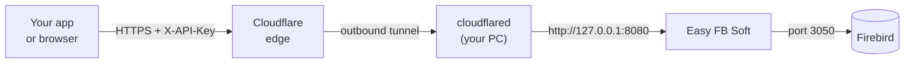

# Easy FB Soft

A Windows desktop app that puts a small, authenticated HTTP API in
front of your Firebird databases, so they can be reached from outside
the machine through a tunnel such as Cloudflare Tunnel — without
exposing Firebird's port 3050 or touching the router.

You add your Firebird connections in the window, turn the ones you
want Online, and the app serves them as JSON over `127.0.0.1`.
`cloudflared` runs on the same machine and forwards to it.



Nothing listens on your LAN and no inbound port is opened: `cloudflared`
dials out to Cloudflare, and the gateway itself only ever binds to
loopback.

## Install

Grab an installer from the
[latest release](https://github.com/kenanwahbeh/FbGateway/releases/latest).

| File | .NET | Use it when |
| ---- | ---- | ----------- |
| `EasyFbSoft-<version>-x64-setup.exe` | included | **Start here.** Normal desktop install. |
| `EasyFbSoft-<version>-x64.msi` | included | Group Policy, Intune, or a scripted rollout. |
| `EasyFbSoft-<version>-x64-framework-setup.exe` | fetched | Much smaller download; Setup installs the runtime if the machine lacks it. |
| `EasyFbSoft-<version>-x64-framework.msi` | required | Scripted rollout where the runtime is managed separately. |

The `-framework` builds need the
[.NET 10 Desktop Runtime (x64)](https://dotnet.microsoft.com/download/dotnet/10.0);
the `-framework` **.exe** downloads and installs it when it is missing,
while the `.msi` expects your deployment tool to handle it. The bundled
builds need nothing else installed.

Both `.exe` installers also offer to install `cloudflared`, skipping the
offer when it is already present. That gets you the connector; pointing
it at a tunnel still needs your own token, which is the whole point —
see [GATEWAY.md](GATEWAY.md).

Requires 64-bit Windows 8.1 or later. All installers are per-machine
and ask for administrator rights once.

## Quick start

1. **Add a database.** Click **+ Add Data**, fill in the Firebird
   server, port, user, password and database path or alias, and use
   **Test Connection** before saving.
2. **Turn it Online.** The card's toggle tests the connection first and
   stays Offline if it fails. Only Online connections answer requests.
3. **Check the gateway.** The **Gateway API** panel should read
   *Running — http://127.0.0.1:8080*. Press **Copy API Key**.
4. **Start the tunnel.**

   ```
   cloudflared tunnel --url http://127.0.0.1:8080
   ```

5. **Confirm the whole path.** `/health` needs no key, so it is the
   first thing to try:

   ```
   curl https://<your-hostname>/health
   ```

   ```json
   { "status": "ok", "service": "EasyFbSoft", "connections": 1, "online": 1 }
   ```

6. **Query.**

   ```bash
   curl -X POST https://<your-hostname>/query \
     -H "X-API-Key: <your key>" \
     -H "Content-Type: application/json" \
     -d '{ "database": "Sales", "sql": "SELECT ID, NAME FROM CUSTOMERS WHERE ID = @id", "parameters": { "id": 42 } }'
   ```

## The API

| Method | Path | Auth |
| ------ | ---- | ---- |
| GET | `/health` | no |
| GET | `/databases` | yes |
| POST | `/query` | yes — `SELECT` / `WITH` only |
| POST | `/execute` | yes — `INSERT` / `UPDATE` / `DELETE` |

[**GATEWAY.md**](GATEWAY.md) has the request and response shapes, the
Firebird-to-JSON type mapping, the status codes, a named-tunnel
`config.yml`, and a troubleshooting section.

## Security

The tunnel makes this reachable from the public internet, so treat the
API key as a database credential.

- Every endpoint except `/health` requires the key, in `X-API-Key` or
  as `Authorization: Bearer`. It is 32 random bytes, generated on first
  run and compared in constant time.
- **New Key** rotates it immediately, without restarting the gateway.
  Every client using the old key stops working at once.
- Send values in `parameters`, never concatenated into `sql`; they are
  bound as Firebird parameters, so a value cannot become SQL.
- `/query` refuses anything that is not a `SELECT` or `WITH`, so a read
  path cannot write by accident.
- The listener binds to `127.0.0.1` only, and a request body over 1 MB
  is refused.
- Anything holding the key can run arbitrary SQL against the Online
  connections. If the data is sensitive, put
  [Cloudflare Access](https://developers.cloudflare.com/cloudflare-one/policies/access/)
  in front of the hostname as well, so callers are authenticated at
  Cloudflare's edge before a request reaches the machine at all.
  [GATEWAY.md](GATEWAY.md#locking-the-tunnel-to-just-you) has the setup.
- Every request, served or rejected, is appended to
  `C:\ProgramData\EasyFbSoft\logs\`. Bound parameter values are never
  written; the statement is.

Connections are stored in
`C:\ProgramData\EasyFbSoft\easyfbsoft.db`. Firebird passwords are kept
there in plain text, so that file deserves the same care as the
credentials themselves.

## Build from source

Needs the .NET 10 SDK and Windows.

```
dotnet build EasyFbSoft.slnx
dotnet run --project EasyFbSoft.csproj
```

To produce the installers the way the release does, see
[`.github/workflows/release.yml`](.github/workflows/release.yml). WiX
and Inno Setup both only run on Windows.

## Tests

```
dotnet test tests/EasyFbSoft.Tests
```

The suite drives the gateway over a real socket on a spare port, with
its settings in a temporary folder, so it never reads or overwrites the
connections of whoever is running it.

| Area | What it covers |
| ---- | -------------- |
| `GatewayServerTests` | Routing, the API key, CORS, body validation, the read-only guard, the size cap, and that an early reply leaves the connection usable. |
| `GatewayLifecycleTests` | Start, stop, restart, a port already in use, key rotation, and connection changes taking effect without a restart. |
| `SqliteDatabaseTests` | Storage, duplicate detection, gateway settings, and the migration from the pre-rename location. |
| `FirebirdExecutorTests` | The read-only guard on its own, including comments, word boundaries and unterminated blocks. |
| `FirebirdIntegrationTests` | A real server end to end: type mapping, NULLs, UTF-8, parameter binding, the row cap, writes, and concurrency. |

`FirebirdIntegrationTests` is skipped unless you point it at a server,
so a fresh clone still gets a green run:

```powershell
$env:EASYFBSOFT_TEST_FIREBIRD = "127.0.0.1:3050:SYSDBA:masterkey:C:\db\test.fdb"
dotnet test tests/EasyFbSoft.Tests
```

It creates its own `EFS_TEST_CUSTOMERS` table and works only on rows it
owns, but point it at a scratch database rather than anything real.

[CI](.github/workflows/ci.yml) runs on every push and pull request, in
two jobs: the build and the whole suite on `windows-latest`, where the
live Firebird tests skip for want of a server, and those same tests on
`ubuntu-latest` against Firebird 4 in a service container. The test
project targets plain `net10.0`, so it runs on Linux unchanged even
though the app itself is Windows-only.

## Versioning

Version numbers are [semantic](https://semver.org/): `MAJOR.MINOR.PATCH`.
For this app that means:

| Bump | When |
| ---- | ---- |
| **MAJOR** | Something that breaks an existing caller: an endpoint or response field removed or renamed, a response shape changed, the authentication scheme changed, or a settings file an older version can no longer read. |
| **MINOR** | New behaviour an existing caller can ignore: a new endpoint, an extra response field, a new option in the window. |
| **PATCH** | Fixes and internal work with no visible change to the API or the UI. |

Anything worth mentioning goes into [CHANGELOG.md](CHANGELOG.md) under
**Unreleased** as it is made, so cutting a release is never a
remembering exercise.

## Releasing

1. Check that the **Unreleased** section of
   [CHANGELOG.md](CHANGELOG.md) describes what is about to ship.
2. Cut the release:

   ```
   pwsh scripts/new-release.ps1 -Version 1.0.0
   ```

   That promotes Unreleased to `## [1.0.0]` with today's date, opens a
   fresh Unreleased section, rewrites the comparison links, commits the
   changelog and creates the `v1.0.0` tag. It refuses to run on an
   empty Unreleased section, an existing tag, or a version that is not
   semantic, and it pushes nothing.
3. Publish:

   ```
   git push origin HEAD --follow-tags
   ```

   The tag starts the release workflow, which builds all four
   installers on Windows, copies that version's changelog section into
   the release body, writes `SHA256SUMS.txt`, and attaches everything
   to a GitHub Release. A tag whose version has no changelog section
   fails the build rather than publishing a release with no notes.

To test the packaging without publishing anything, run the **Release**
workflow manually from the Actions tab. It builds the same four
installers, prints the release body it would have used, and leaves the
files as workflow artifacts — no tag, no release.
