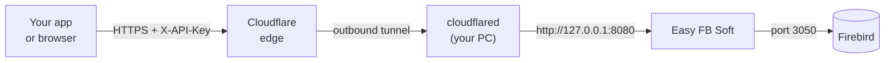

# Easy FB Soft

A Windows desktop app that puts a small, authenticated HTTP API in
front of your Firebird databases, so they can be reached from outside
the machine through a tunnel such as Cloudflare Tunnel — without
exposing Firebird's port 3050 or touching the router.

You add your Firebird connections in the window, turn the ones you
want Online, and the app serves them as JSON over `127.0.0.1`.
`cloudflared` runs on the same machine and forwards to it.



Nothing listens on your LAN and no inbound port is opened: `cloudflared`
dials out to Cloudflare, and the gateway itself only ever binds to
loopback.

## Install

Grab an installer from the
[latest release](https://github.com/kenanwahbeh/FbGateway/releases/latest).

| File | .NET | Use it when |
| ---- | ---- | ----------- |
| `EasyFbSoft-<version>-x64-setup.exe` | included | **Start here.** Normal desktop install. |
| `EasyFbSoft-<version>-x64.msi` | included | Group Policy, Intune, or a scripted rollout. |
| `EasyFbSoft-<version>-x64-framework-setup.exe` | required | You already have the runtime and want a much smaller download. |
| `EasyFbSoft-<version>-x64-framework.msi` | required | Scripted rollout where the runtime is managed separately. |

The `-framework` builds need the
[.NET 10 Desktop Runtime (x64)](https://dotnet.microsoft.com/download/dotnet/10.0).
The bundled builds need nothing else installed.

Requires 64-bit Windows 8.1 or later. All installers are per-machine
and ask for administrator rights once.

## Quick start

1. **Add a database.** Click **+ Add Data**, fill in the Firebird
   server, port, user, password and database path or alias, and use
   **Test Connection** before saving.
2. **Turn it Online.** The card's toggle tests the connection first and
   stays Offline if it fails. Only Online connections answer requests.
3. **Check the gateway.** The **Gateway API** panel should read
   *Running — http://127.0.0.1:8080*. Press **Copy API Key**.
4. **Start the tunnel.**

   ```
   cloudflared tunnel --url http://127.0.0.1:8080
   ```

5. **Confirm the whole path.** `/health` needs no key, so it is the
   first thing to try:

   ```
   curl https://<your-hostname>/health
   ```

   ```json
   { "status": "ok", "service": "EasyFbSoft", "connections": 1, "online": 1 }
   ```

6. **Query.**

   ```bash
   curl -X POST https://<your-hostname>/query \
     -H "X-API-Key: <your key>" \
     -H "Content-Type: application/json" \
     -d '{ "database": "Sales", "sql": "SELECT ID, NAME FROM CUSTOMERS WHERE ID = @id", "parameters": { "id": 42 } }'
   ```

## The API

| Method | Path | Auth |
| ------ | ---- | ---- |
| GET | `/health` | no |
| GET | `/databases` | yes |
| POST | `/query` | yes — `SELECT` / `WITH` only |
| POST | `/execute` | yes — `INSERT` / `UPDATE` / `DELETE` |

[**GATEWAY.md**](GATEWAY.md) has the request and response shapes, the
Firebird-to-JSON type mapping, the status codes, a named-tunnel
`config.yml`, and a troubleshooting section.

## Security

The tunnel makes this reachable from the public internet, so treat the
API key as a database credential.

- Every endpoint except `/health` requires the key, in `X-API-Key` or
  as `Authorization: Bearer`. It is 32 random bytes, generated on first
  run and compared in constant time.
- **New Key** rotates it immediately, without restarting the gateway.
  Every client using the old key stops working at once.
- Send values in `parameters`, never concatenated into `sql`; they are
  bound as Firebird parameters, so a value cannot become SQL.
- `/query` refuses anything that is not a `SELECT` or `WITH`, so a read
  path cannot write by accident.
- The listener binds to `127.0.0.1` only, and a request body over 1 MB
  is refused.
- Anything holding the key can run arbitrary SQL against the Online
  connections. If the data is sensitive, put
  [Cloudflare Access](https://developers.cloudflare.com/cloudflare-one/policies/access/)
  in front of the hostname as well.

Connections are stored in
`C:\ProgramData\EasyFbSoft\easyfbsoft.db`. Firebird passwords are kept
there in plain text, so that file deserves the same care as the
credentials themselves.

## Build from source

Needs the .NET 10 SDK and Windows.

```
dotnet build EasyFbSoft.csproj
dotnet run  --project EasyFbSoft.csproj
```

To produce the installers the way the release does, see
[`.github/workflows/release.yml`](.github/workflows/release.yml). WiX
and Inno Setup both only run on Windows.

## Releasing

Push a tag; the workflow builds all four installers on Windows and
attaches them to a GitHub Release:

```
git tag v1.0.0
git push origin v1.0.0
```

To test a packaging change without publishing anything, run the
**Release** workflow manually from the Actions tab — it builds the same
installers and leaves them as workflow artifacts.
